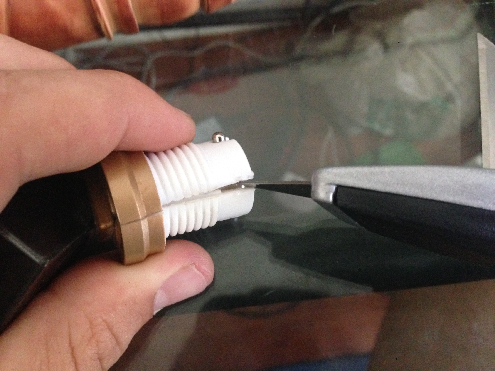

Creative Kingdom makes Live Action Roll Play games for children. All of their games use an IR want to control game elements scattered around a park. Their flagship product, Magiquest, can be found in amusement parks across the country. They also do custom work, such as DinoQuest, at the Discovery Science Center in Santa Ana. This particular wand was from DinoQuest.

Their wands are supposed to have no user serviceable parts, however the top of the wand unscrews easily revealing electrical contacts.

I was expecting this top portion to contain lithium button cell batteries, however after prying it open I was disappointed. The batteries are buried somewhere in the belly of the beast.

While there is only 1 topper in DinoQuest, other games have different toppers available to purchase that provide different abilities in the game. Seeing as these toppers have no electrical components, I was stumped as to how the game knew which topper you were using. [This is de-mistified later]

The body of the wand is two injection molded halves that have been epoxied together. To reenforce the threaded section top, a solid ring was glued around the body.

I started using the box cutter to cut down the sides of the seams, however the epoxy was strong and my blade was dull.

Eventually I pried out two AA Alkaline batteries. It became evident after I had cracked the case open that there was a second screw cap under the topper that could be removed with a flat head screw driver. Oh well....

I continued cracking down the body of the wand until I got to the inevitable PCB. The batteries had leaked acid down the body and the entire board was covered in a crystalline substance that makes your hands itch.

The final dissasembly:

The black blob IC was revealed, along with two vibration sensors, the IR emitter, transistor, and an inductor, and a few electrolytic capacitors. There were 4 test pads labled Vss, SDA, SCL, and TEST. Evidently a form of I2C test interface.

The only unexpected component was an IR reiver, and associated amplifier. A clear plastic light  tunnel evidently carried a signal up the want barrel and into the resiever, which is located behind the emitter. This must have been used for programming a unique ID into each want upon purchase, and possibly for programming which topper is installed onto the wand.

The back side of the board has a reset button and power leads.

### Update:
Commenter Jen points out that the batteries are indeed replaceable.
1. Unscrew the base/top portion.
2. Used a mini standard screwdriver to unscrew the white battery cover in between the two prongs.
3. When you remove the battery cap the batteries will fall out.
4. Replace with 2 AA batteries with – down into wand.
5. Screw battery cap into wand.